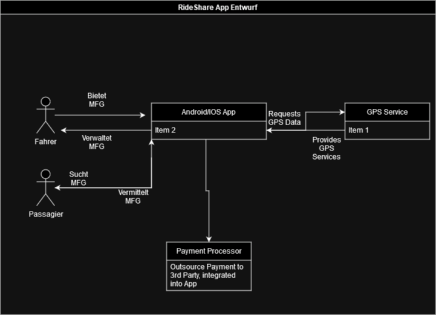
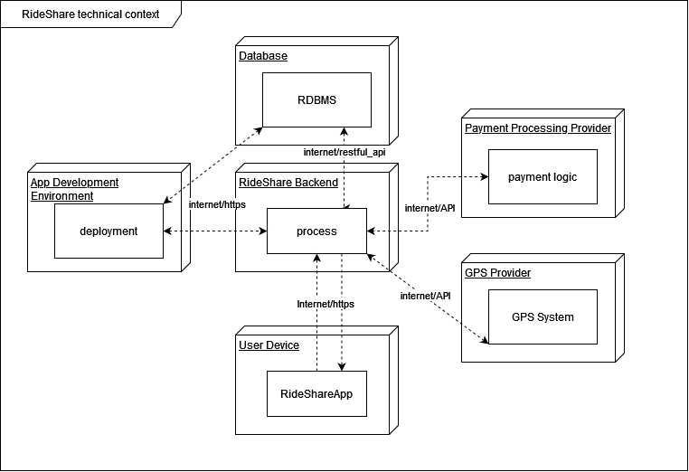
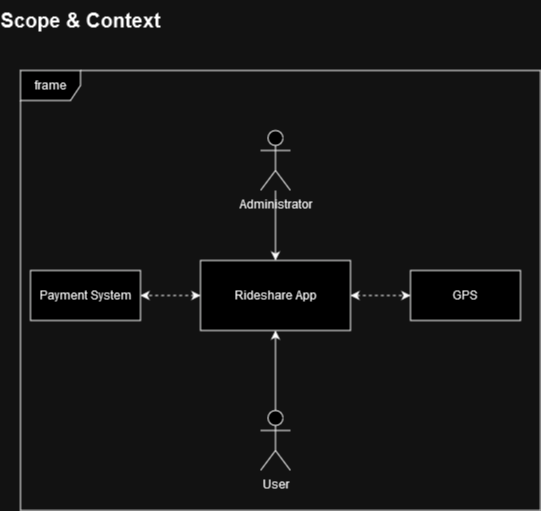
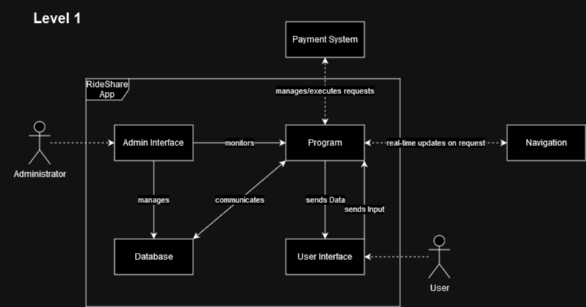
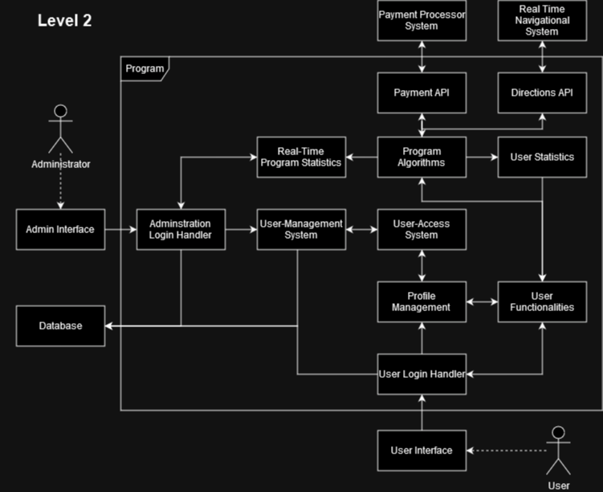
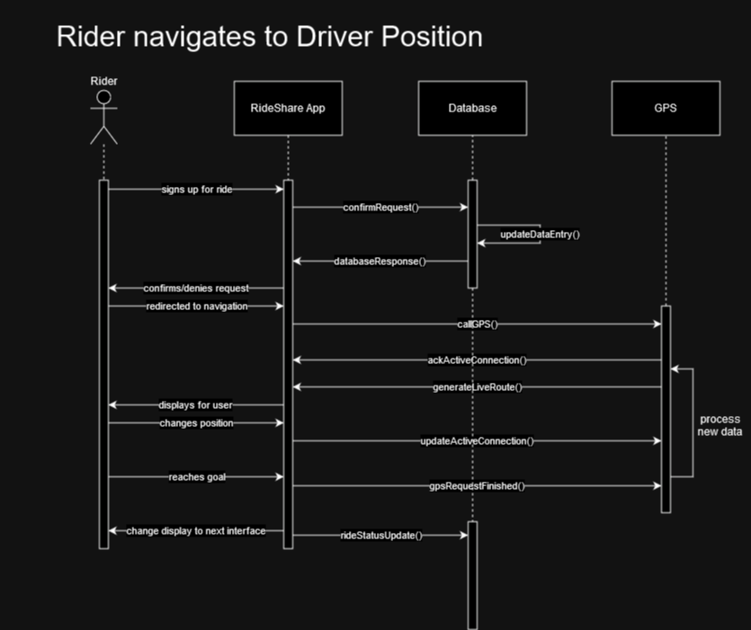
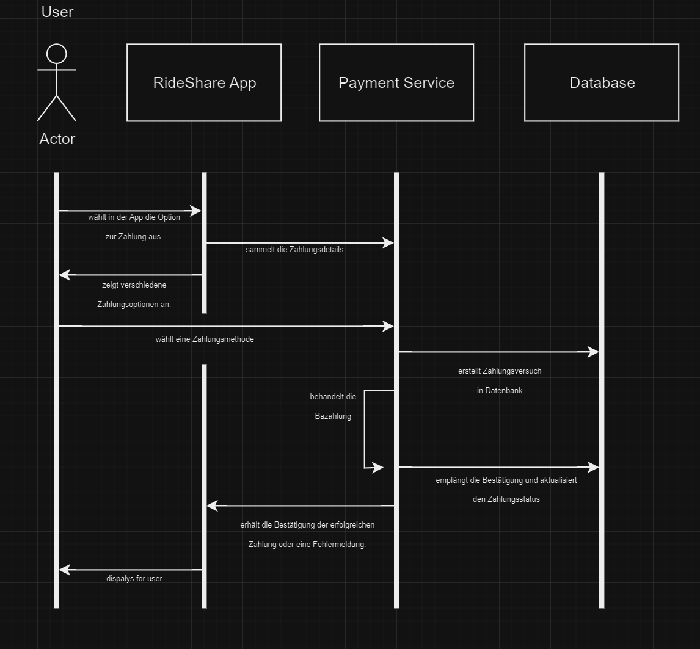
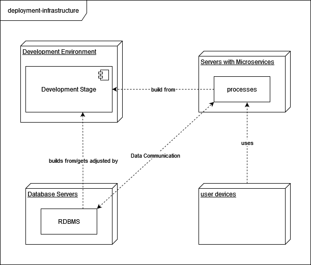
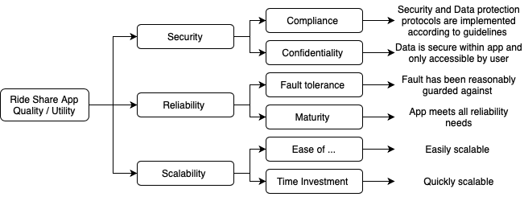

# Introduction and Goals

RideShare Start-Up ist ein Start-Up mit 5-8 Mitarbeitern, das ein RideShare Programm entwickelt.
Folgende grundlegende Requirements, Quality Goals und Stakeholders wurden als signifikant identifiziert.

## Requirements Overview

**Contents**

### Functional Requirements:

* User Registrierung:

  * Nutzung ohne Erstellung eines repräsentativen Users unmöglich/nicht tragbar
* Profilerstellung:

  * Gewährleistet diversen Usern eine personalisierte Erfahrung
  * Erlaubt Rückverfolgung von Eventuellen Problemen
* Suche und Bestellen von Mitfahrgelegenheiten:

  * Basisfunktionalität der App
* Real-time Nachverfolgung von den Mitfahrgelegenheiten:

  * Aktives Tracking um Startort, Standort und Zielort mit der Realität abzugleichen
* Real-time Updates von den Mitfahrgelegenheiten:

  * Abgelaufene/Losgefahrene Mitfahrgelegenheiten sollen nicht mehr angezeigt werden
  * Kurzfristige und Langfristige Angebote
* Integriertes Zahlungssystem:

  * Erleichterung des Zahlungsprozesses zwischen Fahrern und Passagieren
* Verifizierungs, Bewertungs und Zulassungssystem von den Fahrern und Passagieren:

  * Ermöglicht Feedback für zukünftige Nutzung von beiden Seiten
  * Sperrung von Usern die generell negativ auffallen
* User Feedback und Support System:

  * Dient der Bug-Findung, QOL-Identifikation und App-spezifischer Problemlösung
* Report- und Analysefunktionen:

  * Unterstützt die User mit gesammelten Daten und Statistiken zu ihren Fahrten
  * Erlaubt die Meldung von eventuellen Verstößen

### Non-functional Requirements:

* Hohes level von Security und Datenschutz
* Skalierbar um hohes Volumen an Nutzern und Fahrern unterstützen zu können
* Leistungsoptimisierung um eine schnelle, zuverlässige App-Nutzung zu garantieren
* Vereinbarkeit mit diversen Mobilgeräten und Betriebssystemen
* Einhaltung von allen relevanten Vorschriften und Notwendigkeiten

## Quality Goals

| Quality Goal | Concrete Scenario                                                                                 | Priority |
| ------------ | ------------------------------------------------------------------------------------------------- | -------- |
| Security     | Sensitive Daten sollen unter keinen Umständen in die Hände Unbefugter fallen                    | 1        |
| Reliabilty   | Alle verfügbaren Informationen sollen zu jeder Zeit zuverlässig verfügbar sein                 | 2        |
| Scalability  | Es wurde von Stakeholdern gewünscht das die App schnell auf höhere Anforderungen skalierbar ist | 3        |

## Stakeholders

| Role/Name     | Contact                        | Expectations            |
| ------------- | ------------------------------ | ----------------------- |
| Maryam Pate   | Venture Capital Firm XYZ       | *                       |
| Raj Gupta     | Local Transportation Authority | *                       |
| Megan Chen    | Creative Agency ABC            | *                       |
| Amirah Rahman | RideShare Driver Association   | *                       |
| Javier Gomez  | Sustainable Transportation NGO | *                       |
| John          | Investor                       | Innovation, Skalierbarkeit |
| Fahrer        | RideShare Driver Association   | *                       |

# Architecture Constraints

| Constraints                           | Background and/or motivation                                                                                   |
| ------------------------------------- | -------------------------------------------------------------------------------------------------------------- |
| Limited Resources & Funding           | Als Start-Up sind die verfügbaren Ressourcen limitiert                                                        |
| Mobile App                            | Zielt hauptsächlich auf mobile Kundschaft ab und erhöht Flexibilität (Autos haben keinen PC)                |
| Reliable & Stable Internet Connection | Um Funktionalität zu gewährleisten, muss eine durchgehende Verbindung zum Internet bestehen                  |
| Limited Scope                         | Entwicklung des Programms ist auf die wichtigsten Elemente reduziert, entsprechend der Teamgröße             |
| Local Laws and Restrictions           | App muss Gesetzeskonform gegenüber lokalen Regelungen etc. sein um eventuellen legalen Konflikten vorzubeugen |

# System Scope and Context

## Business Context

**Details**

## Technical Context

| **_Node / Artifact_**       | **_Description_**                                                                                                                     |
|-----------------------------|---------------------------------------------------------------------------------------------------------------------------------------|
| App Development Environment | Umgebung für Entwicklung, Überwachung und Deployment des Systems, agiert basierend auf DevOps Prinzipien                              |
| Database                    | Off-Location Datenbank mit ausgewähltem RDBMS die relevante Nutzer und Systemdaten speichert                                          |
| RideShare Backend           | Herz des Systems, ein Kollektiv an Prozessen die jede Kommunikation weiterverarbeiten                                                 |
| User Device                 | Handy oder Tablet mit installierter RideShare App, schickt Nutzer-Kommunikation und Information an das Backend und umgekehrt          |
| GPS Provider                | Stellt ein GPS zur verfügung mit dessen Hilfe die App relevante Daten für die Nutzer bereitstellen kann                               |
| Payment Processing Provider | Verarbeitet Transaktionen zwischen Nutzern und der App/anderen Nutzern und stellt sicher dass diese sicher und rechtskonform ablaufen |

# Solution Strategy

**Contents**

Dieser Abschnitt skizziert die primären Entscheidungen und Lösungsstrategien, die den Kern unserer Systemarchitektur für die Fahrgemeinschafts-App bilden. Unser Fokus umfasst:

- Technologieentscheidungen: Die Übernahme eines robusten und skalierbaren Technologiestapels, einschließlich eines cloud-basierten Back-Ends für Flexibilität und Skalierbarkeit, einer relationalen Datenbank für Datenintegrität und der Entwicklung von nativen mobilen Apps, um eine nahtlose Benutzererfahrung zu gewährleisten.

- Systemzerlegung: Nutzung einer Mikroservices-Architektur, um einen skalierbaren, unabhängigen Einsatz verschiedener Aspekte der Anwendung zu ermöglichen, wie Benutzerverwaltung, Fahrtenvermittlung, Zahlungsabwicklung und Feedback-Systeme.

- Erreichen von Qualitätszielen:

    * Leistung: Implementierung effizienter Algorithmen für Fahrtenvermittlung und Standortverfolgung, um eine hohe Reaktionsfähigkeit zu gewährleisten.
    * Sicherheit: Sicherstellung von Datenschutz und -sicherheit durch Ende-zu-Ende-Verschlüsselung und regelmäßige Sicherheitsaudits.
    * Benutzerfreundlichkeit: Fokus auf intuitives UI/UX-Design für Fahrer und Passagiere, um die Benutzerzufriedenheit zu erhöhen.
- Organisatorische Entscheidungen:

    * Entwicklungsprozess: Übernahme agiler Methoden, um eine schnelle und anpassungsfähige Reaktion auf Feedback und sich ändernde Anforderungen zu ermöglichen.
    * Integrationen von Drittanbietern: Delegieren von Aufgaben wie Zahlungsabwicklung an zuverlässige Drittanbieterdienste, um Sicherheit und Effizienz zu gewährleisten.

**Motivation**

Diese strategischen Entscheidungen dienen als Grundlage unserer Architektur und leiten detailliertere Entscheidungen und Implementierungsregeln. Sie sind motiviert durch unsere Hauptziele: die Schaffung einer effizienten, sicheren und benutzerfreundlichen Fahrgemeinschaftsplattform. Diese Entscheidungen sind in unserem Verständnis der Problemstellung verankert, unserer Verpflichtung zu Qualitätszielen und der Notwendigkeit, Schlüsselbeschränkungen effektiv zu navigieren.

| **Goal/Requirements** | **Architectural Approach**                                                                                                                                                                                                                                                                                                                                                                                                                   |
|-----------------------|----------------------------------------------------------------------------------------------------------------------------------------------------------------------------------------------------------------------------------------------------------------------------------------------------------------------------------------------------------------------------------------------------------------------------------------------|
| Security              | Im Rahmen des Microservice-Ansatzes wird zur Gewährleistung der Sicherheit ein dezentrales Muster verwendet, um die Skalierbarkeit zu unterstützen und die größte Garantie zu bieten. Es sollte sich um eine Lösung auf Plattformebene handeln, für die ein eigenes Team zuständig ist und die zur einfacheren Implementierung auf bestehenden Lösungen basiert.                                                                             |
| Reliability           | Um so zuverlässig wie möglich zu sein, muss ein Microservice-Modell ein gewisses Maß an Fehlertoleranz aufweisen. Darüber hinaus muss eine klare Dokumentation für die Fehlersuche und Systemwartung geführt werden, mit einer Implementierung von Monitoring, Logging und Health Checks. Darüber hinaus ist es wichtig, die Dienste voneinander zu isolieren, um zu verhindern, dass der Ausfall eines Teils sich auf die anderen auswirkt. |
| Scalability           | Die Microservices-Architektur ermöglicht granulare Skalierbarkeit, Lastausgleich, Fehlerisolierung, unabhängige Bereitstellung, technologische Flexibilität, Elastizität, Ressourceneffizienz und verbesserte Leistung und ist damit ideal für die Erfüllung von Skalierungsanforderungen.                                                                                                                                                   |

# Building Block View

## Scope and Context

* frame:
    * Stellt das gesamte Framework abstrahiert dar

| **Name**     | **Responsibility** |
| ------------------ | ------------------------ |
| RideShare App | Verwaltet alle Funktionalitäten der App, verarbeitet alle notwendigen Daten, gibt Feedback zu eventuellen Problemen.              |
| Payment System | Nimmt Payment Requests entgegen und stellt sicher, dass diese Rechtskonform, sicher und adäquat durchgeführt werden.              |
| GPS | Kommunziert mit der Rideshare App via API und stellt relevante Routen-, Positions- und Ortsdaten zur Verfügung  |
| Administrator | Personal mit der Zuständigkeit für die Verwaltung, Wartung und Überwachung des Systemstatus  |
| User | Nutzer der App    |

## Level 1

### White Box *RideShare App*

Die interne Struktur der RideShare App, eine Darstellung der internen Architektur mit etwas mehr Details

| **Name**     | **Responsibility** |
| ------------------ | ------------------------ |
| Admin Interface | Erlaubt den Administratoren/-innen ihre Verpflichtungen gegenüber der App zu verfolgen |
| Database | Speichert & Verwaltet relvante System- und Nutzerdaten |
| Program | Das Kollektiv an Prozessen die relevante Daten verarbeiten und für die Administratoren/-innen und Nutzer/innen aufbereiten |
| User Interface | Zeigt verarbeitete und aufbereitete Daten für den Nutzer an, sammelt und sendet Systemrelevante Daten an das Programm |

## Level 2

### White Box *RideShare App -> Program*

Eine Detailansicht der Programmarchitektur.

# Runtime View

## \<Scenario1 - Rider Navigiert zu Fahrerposition>

  
Im Diagramm sind vier Akteure dargestellt: Rider, RideShare App, Database und GPS. Hier ist die Beschreibung des dargestellten Prozesses:
1. Der Rider meldet sich für eine Fahrt an.
2. Die App sendet eine Anfrage zur Bestätigung an die Datenbank.
3. Die Datenbank antwortet auf die Anfrage und die App leitet den Nutzer zur Navigationsansicht weiter.
4. Der Nutzer bekommt die Position des Fahrers in der App angezeigt und kann seine eigene Position ändern.
5. Nachdem der Nutzer sein Ziel erreicht hat, aktualisiert die App den Status der Fahrt und wechselt zur nächsten Benutzeroberfläche.

## \<Scenario2 - Rider Zahlungsversuch>

Für das Szenario "Nutzer bezahlt eine Fahrt" in einer Fahrgemeinschafts-App können wir die folgenden wichtigen Schritte in Betracht ziehen:

1. Nutzer wählt die Zahlungsoption in der App aus.
2. App sendet Zahlungsdetails an den Zahlungsservice.
3. Zahlungsservice interagiert mit dem Zahlungsgateway.
4. Zahlungsgateway führt die Transaktion durch und sendet eine Antwort.
5. Zahlungsservice aktualisiert den Zahlungsstatus in der Datenbank.
6. App zeigt dem Nutzer den Zahlungsstatus an.

# Deployment View

**Motivation**

Diese einfache Darstellung der Infrastruktur soll den Leser/innen und Stakeholdern der Architektur ein ungefähres Verständnis dieser näherbringen. Ohne konkret über technische Details Bescheid zu geben, soll mit Hilfe des Diagramms ein Bild bereitgestellt werden das eine gewisse Übersicht gibt.

**Dezentralisierte Infrastruktur**
Die gesamte Infrastruktur folgt einem dezentralisiertem Modell, bei dem die Entwicklungsumgebung physisch getrennt ist von den tatsächlich aktiven Servern, auf denen die RideShare Applikation und ihre assozierten Services laufen werden. Auch bei eventuellen Störungen wie Stromausfall in der Entwicklungsumgebung, sollten die Server und der Service als Ganzes nicht grob beeinflusst werden. Auch bei Ausfall von non-kritischen Services, sollte eine grundlegende Funktionalität dadurch gewährleistet werden.

# Architecture Decisions

| **Problem**                     | **Considered Alternatives**        | **Decision**                     |
|---------------------------------|------------------------------------|----------------------------------|
| Security Architecture           | _Monolithic vs. Microservices_     | Microservices                    |
| Reliability and Fault Tolerance | _Active-Passive vs. Active-Active_ | Active-Active with Microservices |
| Scalability and Deployment      | _Monolithic vs. Microservices_     | Microservices                    |

### **Warum Microservices als StartUp?**

Nach intesiver Konversation und Kollaboration mit unseren Stakeholders, sind wir zu dem Schluss gekommen, dass nach erfolgreichem Start eine rapide Expansion in neue Gebiete vorgesehen ist. Da es nicht notwendig ist so schnell wie möglich an den Markt zu kommen, ist es wichtiger ein gesundes Framework zu erstellen, welches das dann auch möglichst problemlos ermöglicht. Es bedeutet zwar eine kurzfristige Erhöhung der Entwicklungszeit, aber dient dazu zukünftige Entwicklungszyklen agiler umsetzen zu können.

# Quality Requirements

## Quality Tree

## Quality Scenarios

### Security

* Ein Nutzer hat sensitive Daten auf der App gespeichert. Obwohl sein Login in falschen Händen landet, sind seine Daten sicher und können nicht über die App gefährdet werden.

### Reliability

* Eine Fahrerin verwendet die App, um sich zu einem Fahrgast zu navigieren, während sie durch einen Tunnel fährt. Obwohl die Verbindung instabil ist, wird eine ungefähre Route angezeigt, und der Fahrgast wird erreicht.

### Scalability

* Ein Entwicklungsteam wurde damit beauftragt die App auf eine Expansion vorzubereiten. Obwohl erwartet wird, dass sich die Nutzeranzahl verdoppeln wird, verzögert die damit einhergehende Skalierung der relevanten Systeme die Entwicklungszeit nicht.

# Risks and Technical Debts

| **Risk/Technical Debt**             | **Description**                                                                                                                                                                                                                                                                                                                                                                                                                                                                                                                                                            |
|-------------------------------------|----------------------------------------------------------------------------------------------------------------------------------------------------------------------------------------------------------------------------------------------------------------------------------------------------------------------------------------------------------------------------------------------------------------------------------------------------------------------------------------------------------------------------------------------------------------------------|
| Data Security Vulnerabilities       | Die Microservices-Architektur kann aufgrund des verteilten Charakters des Systems potenzielle Sicherheitsschwachstellen aufweisen, die zu Datenverletzungen und unbefugtem Zugriff führen können.Empfohlene Maßnahmen: Implementieren Sie starke Authentifizierungs- und Autorisierungsmechanismen, verschlüsseln Sie Daten bei der Übertragung und im Ruhezustand, führen Sie regelmäßige Sicherheitsaudits durch und halten Sie Sicherheits-Patches auf dem neuesten Stand, um diese Risiken zu minimieren.                                                              |
| Service Interdependencies           | Durch die Abhängigkeit von Diensten kann ein komplexes Netz von Interaktionen entstehen, das das Risiko erhöht, dass sich Fehler kaskadenartig im System ausbreiten und dessen Zuverlässigkeit und Betriebszeit beeinträchtigen können.Empfohlene Maßnahmen:Implementieren Sie eine strikte Dienstisolierung, entwerfen Sie Verträge und APIs sorgfältig und verwenden Sie Stromkreisunterbrecher, um Ausfälle zu verwalten und die Systemstabilität zu erhalten. Regelmäßige Überwachung und Protokollierung von Dienstinteraktionen, um Probleme frühzeitig zu erkennen. |
| Technical Debt Due to Rapid Scaling | Die schnelle Skalierung von Microservices kann zu technischen Schulden in Bezug auf die Überwachung, die Bereitstellung von Ressourcen und die richtige Dokumentation führen, was sich langfristig auf die Wartbarkeit und die Fehlerbehebung auswirkt: Implementieren Sie automatisierte Skalierungs- und Überwachungslösungen (z. B. Kubernetes für die Orchestrierung), aktualisieren und verbessern Sie regelmäßig die Dokumentation und planen Sie Zeit für Refactoring und Sprints zum Abbau technischer Schulden ein, um diese Probleme proaktiv anzugehen.         |

# Glossary

| Term          | Definition          |
| ------------- | ------------------- |
| Stakeholder | Eine Person, Gruppe oder Organisation, die ein Interesse an den Ergebnissen einer Softwarearchitektur hat oder von ihnen betroffen ist. Dazu gehören unter anderem Kunden, Benutzer, Entwickler, Architekten, Projektmanager und Auftraggeber. |
| Server | Ein Computer oder System, das über ein Netzwerk Ressourcen, Daten, Dienste oder Programme für andere Computer, sogenannte Clients, bereitstellt. In Bezug auf die Softwarearchitektur bezieht sich der Begriff häufig auf einen Computer, der einen Webdienst oder eine Webanwendung hostet. |
| Infrastruktur | Die Struktur in der das gesamte RideShare Service läuft | 
| App | Kurzform für Applikation - hier immer die RideShare Applikation |
| Scalability | Skalierbarkeit - wie leicht ist es auszubauen |
